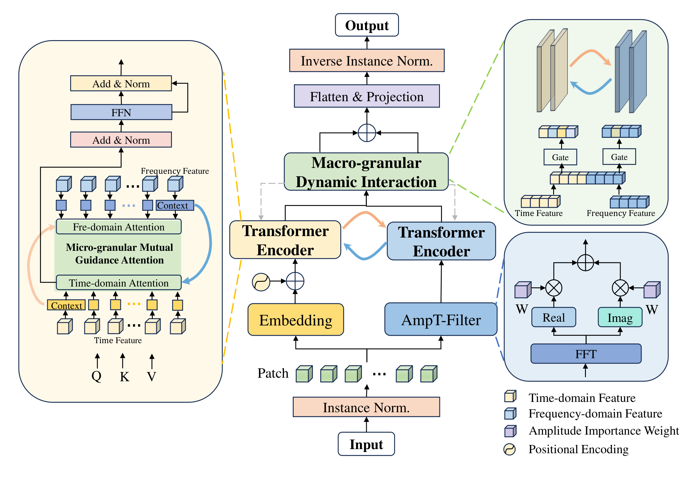

# DTFformer

Dual-Granularity Time-Frequency Interaction Transformer for Time Series Forecasting

## Overview

Time series forecasting often struggles to balance time-domain local dynamics and frequency-domain global patterns. **DTFformer** addresses this challenge with a dual-granularity interaction mechanism.

Instead of simple concatenation, the model progressively fuses information from both domains:

- **Micro-level interaction:** time-domain and frequency-domain features provide mutual context during attention computation.
- **Macro-level interaction:** inter-layer gating networks dynamically control information exchange between the two branches.
- **Adaptive noise reduction:** the AmpT-Filter enhances informative frequency components and suppresses noise.

## Model architecture

<p align="center">
  
</p>

<p align="center">
  <em>Overall architecture of DTFformer.</em>
</p>

## Tested environment

The released implementation was tested with the following environment:

| Component | Version |
| --- | --- |
| Operating system | Windows |
| Python | 3.8.20 |
| PyTorch | 1.12.1+cu116 |
| CUDA | 11.6 |
| cuDNN | 8.3.2 |
| GPU | NVIDIA GeForce RTX 3080 |

## Installation

Clone the repository and create a Python 3.8 environment:

```bash
git clone https://github.com/time-series-Labo/DTFformer.git
cd DTFformer
conda create -n dtfformer python=3.8.20 -y
conda activate dtfformer
python -m pip install --upgrade pip
pip install -r requirements.txt
```

The first line of `requirements.txt` points pip to the official PyTorch CUDA 11.6 wheel index. If a different CUDA or CPU-only build is required, install the appropriate PyTorch build first and then install the remaining dependencies.

## Data preparation

Place datasets under the following directory structure:

```text
dataset/
├── ETT/
│   ├── ETTh1.csv
│   ├── ETTh2.csv
│   ├── ETTm1.csv
│   └── ETTm2.csv
├── weather.csv
├── wind1.csv
└── wind2.csv
```

The ETT datasets are available from the [ETDataset repository](https://github.com/zhouhaoyi/ETDataset). Please prepare the Weather and Wind datasets in the same CSV format expected by `data_provider/data_loader.py`.

## Quick start

Train and evaluate DTFformer on ETTh1 with an input length of 96 and a prediction length of 96:

```bash
python run.py \
  --is_training 1 \
  --model_id ETTh1_96_96 \
  --model DTFformer \
  --data ETTh1 \
  --seq_len 96 \
  --pred_len 96 \
  --itr 3
```

Available models are `DTFformer`, `DLinear`, `FEDformer`, `FilterTS`, `PatchTST`, `TimeMixer`, `WPMixer`, and `iTransformer`.

The main experimental settings reported in the paper use an input length of 96, prediction lengths in `{96, 192, 336, 720}`, a batch size of 64, two encoder layers, a model dimension of 512, eight attention heads, a learning rate of `5e-5`, and three independent runs.
